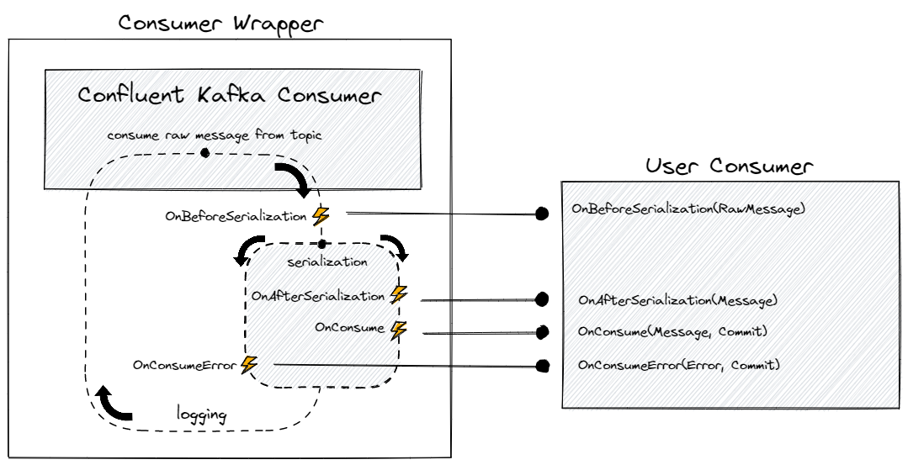

Reactive .Net Client for Apache Kafka<sup>TM</sup>
=========================================

[](https://www.nuget.org/packages/Reactive.Kafka.Client/)
[](https://ci.appveyor.com/project/RFPAlves/reactive-kafka-client/branch/main)
[](https://ci.appveyor.com/project/RFPAlves/reactive-kafka-client/branch/main/tests)

Features:

- **Abstract** and **simplify** integrations with confluent kafka.
- Possibility to run **multi consumers** in the same application.
- Ease to run a **consumer per partition** using threads.
- Message **deserialization** to the desired object effortless.
- Specific method for the correct treatment of **error messages**.

## Installation
To install Reactive.Kafka.Client from within Visual Studio, search for Reactive.Kafka.Client in the NuGet Package Manager UI, or run the following command in the Package Manager Console:

```
Install-Package Reactive.Kafka.Client -Version 1.0.0
```

To add a reference to a dotnet core project, execute the following at the command line:

```
dotnet add package -v 1.0.0 Reactive.Kafka.Client
```

## Message lifecycle

A message has a lifecycle that starts whenever a new message is obtained from topic. Your application can use lifecycle hook methods for the treatment or enrichment of the message.

### Responding to lifecycle events

Respond to events in the lifecycle of a message by overriding one or more of the lifecycle hook methods. The hooks give you the opportunity to act on a message before its use in your business logic.

```csharp
public class MyConsumer : ConsumerBase<Message>
{
    public override void OnConsumerConfiguration(IConsumer<string, string> consumer)
    {
        // your consumer settings here.
    }

    public override string OnBeforeSerialization(string rawMessage)
    {
        // your treatment here.
    }
    
    public override Message OnAfterSerialization(Message message)
    {
        // your enrichment here.
    }
    
    public override Task OnConsume(ConsumerMessage<Message> consumerMessage, Commit commit)
    {
        // your business logic here.
        return Task.CompletedTask;
    }
}
```

`OnConsume` and `OnConsumerBuilder` are required. The others are not required and you implement just the ones you need.

### Lifecycle event sequence

| Hook method             | Purpose                                   | Timing                                                                                  | Required |
|-------------------------|-------------------------------------------|-----------------------------------------------------------------------------------------|----------|
| OnConsumerBuilder       |                                           | Called once, for each consumer instance, before confluent kafka consumer built.         | No       |
| OnProducerBuilder       | Producer instance for message forwarding. | Called once, for each consumer instance, before confluent kafka producer built.         | No       |
| OnConsumerConfiguration |                                           | Called once, for each consumer instance, after confluent kafka consumer has been built. | Yes      |
| OnBeforeSerialization   | Treatment of the message.                 | Called after message consume from topic and before `OnAfterSerialization`.              | No       |
| OnAfterSerialization    | Enrichment of the message.                | Called after serialization process, may not occur if serialization fails.               | No       |
| OnConsume               | Business logic.                           | Called immediately after `OnAfterSerialization` for each message.                       | Yes      |
| OnConsumeError          |                                           | Called when serialization process fails.                                                | No       |

## Concept


## Usage

- Exclusive thread per consumer.
- Possibility to inject anything from DI (Dependency Injection) in your consumer.

Check out our examples for a full demonstration. 😉

### AddReactiveKafkaConsumerPerPartition

Creates a consumer per partition of a given topic.

```csharp
// Message.cs
public class Message
{
    public int Id { get; set; }
    public string Name { get; set; }
}
```

```csharp
// ConsumerExample.cs
public class ConsumerExample : ConsumerBase<Message>
{
    public override void OnProducerBuilder(ProducerConfig builder)
    {
        builder.BootstrapServers = "localhost:9092";
        builder.Acks = Acks.None;
    }

    public override void OnConsumerConfiguration(IConsumer<string, string> consumer)
    {
        consumer.Subscribe("your-topic");
    }

    public override async Task OnConsume(ConsumerMessage<Message> consumerMessage, Commit commit)
    {       
        if (consumerMessage.Id == 0) {
            await ProducerAsync("DeadLetterTopic", consumerMessage.Message);
            return;
        }
        
        Console.WriteLine(consumerMessage.Message);
    }
}
```

```csharp
// Program.cs
using Reactive.Kafka.Extensions;

IHost host = Host.CreateDefaultBuilder(args)
    .ConfigureServices(services =>
    {
        services.AddHostedService<Worker>();
        services.AddReactiveKafkaConsumerPerPartition<ConsumerExample>("localhost:9092");
    })
    .Build();

await host.RunAsync();
```

### AddReactiveKafkaConsumerPerQuantity

Creates a specified number of consumer in a given topic.

```csharp
// ConsumerExample.cs
public class ConsumerExample : ConsumerBase<string>
{
    public override void OnConsumerConfiguration(IConsumer<string, string> consumer)
    {
        consumer.Subscribe("your-topic");
    }
    
    public override string OnBeforeSerialization(string rawMessage)
    {
        string newMessage = Regex.Replace(rawMessage, @"\D", "");
        return newMessage;
    }

    public override Task OnConsume(ConsumerMessage<string> consumerMessage, Commit commit)
    {
        Console.WriteLine(consumerMessage.Message);
        return Task.CompletedTask;
    }
}
```

```csharp
// Program.cs
using Reactive.Kafka.Extensions;

IHost host = Host.CreateDefaultBuilder(args)
    .ConfigureServices(services =>
    {
        services.AddHostedService<Worker>();
        services.AddReactiveKafkaConsumerPerQuantity<ConsumerExample>("localhost:9092", quantity: 2);
    })
    .Build();

await host.RunAsync();
```

### AddReactiveKafkaConsumer

Looks for consumers in the calling assembly. You have more control over consumers and what topic they listen to.

This method doesn't create consumers per partition, for example, if you want three consumers on a topic with three partitions, you need to create three consumers listening to the same topic with the same group id.

```csharp
// Consumer1.cs
public class Consumer1 : ConsumerBase<string>
{
    public override void OnConsumerConfiguration(IConsumer<string, string> consumer)
    {
        consumer.Subscribe("your-topic");
    }

    public override Task OnConsume(ConsumerMessage<string> consumerMessage, Commit commit)
    {
        Console.WriteLine(consumerMessage.Message);
        return Task.CompletedTask;
    }
}
```

Consumer1 will listen for the `your-topic` topic with a random generated group id.

```csharp
// Consumer2.cs
public class Consumer2 : ConsumerBase<int>
{
    public override void OnConsumerConfiguration(IConsumer<string, string> consumer)
    {
        consumer.Subscribe("your-another-topic");
    }

    public override void OnConsumerBuilder(ConsumerConfig builder)
    {
        builder.GroupId = "your-group";
        builder.AutoCommitIntervalMs = 0;
        builder.EnableAutoCommit = false;
    }

    public override Task OnConsume(ConsumerMessage<int> consumerMessage, Commit commit)
    {
        Console.WriteLine(consumerMessage.Message);
        return Task.CompletedTask;
    }
}
```

Consumer2 will listen for the `your-another-topic` topic with `your-group` as the group id and with auto commit disabled. 

```csharp
// Program.cs
using Reactive.Kafka.Extensions;

IHost host = Host.CreateDefaultBuilder(args)
    .ConfigureServices(services =>
    {
        services.AddHostedService<Worker>();
        services.AddReactiveKafkaConsumer("localhost:9092");
    })
    .Build();

await host.RunAsync();
```

## Future features

- Consumer healthcheck as a ASP.NET plugin.
