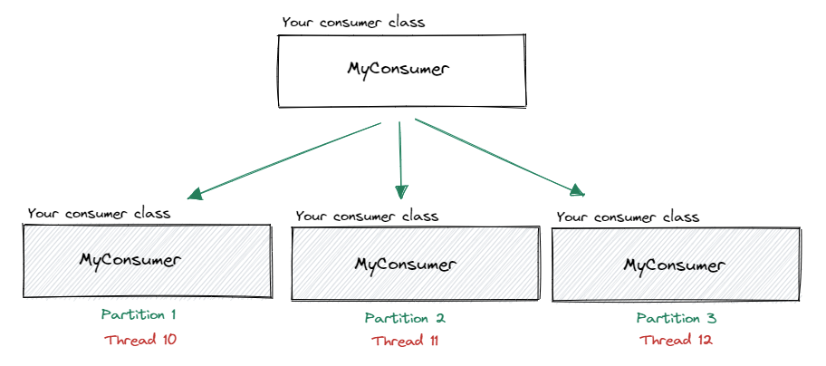
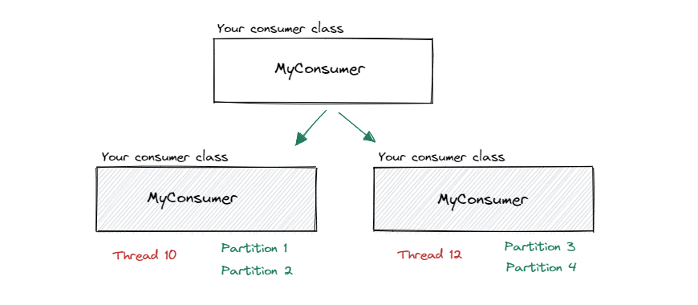

Reactive .Net Client for Apache Kafka<sup>TM</sup>
=========================================

[](https://www.nuget.org/packages/Reactive.Kafka.Client/)
[](https://ci.appveyor.com/project/RFPAlves/reactive-kafka-client/branch/main)
[](https://ci.appveyor.com/project/RFPAlves/reactive-kafka-client/branch/main/tests)

Features:

- **Abstract** and **simplify** integrations with confluent kafka.
- Possibility to run **multi consumers** in the same application.
- Ease to run a **consumer per partition** using threads.
- Message **deserialization** to the desired object effortless.
- Specific method for the correct treatment of **error messages**.

## Installation
To install Reactive.Kafka.Client from within Visual Studio, search for Reactive.Kafka.Client in the NuGet Package Manager UI, or run the following command in the Package Manager Console:

```
Install-Package Reactive.Kafka.Client -Version 3.0.0
```

To add a reference to a dotnet core project, execute the following at the command line:

```
dotnet add package -v 3.0.0 Reactive.Kafka.Client
```

## Message lifecycle

A message has a lifecycle that starts whenever a new message is obtained from topic. Your application can use lifecycle hook methods for the treatment or enrichment of the message.

### Responding to lifecycle events

Respond to events in the lifecycle of a message by overriding one or more of the lifecycle hook methods. The hooks give you the opportunity to act on a message before its use in your business logic.

```csharp
public class MyConsumer : ConsumerBase<Message>
{
    public override void OnConsumerConfiguration(ConsumerConfig configuration) { }
    public override void OnProducerConfiguration(ProducerConfig configuration) { }
    public override void OnConsumerBuilder(ConsumerBuilder<string, string> builder) { }
    public override void OnReady() { }
    public override string OnBeforeSerialization(string rawMessage) { }
    public override Message OnAfterSerialization(Message message) { }  
    public override Task OnConsume(ConsumerMessage<Message> consumerMessage, ConsumerContext context) { }
    public override Task OnConsumeError(ConsumerContext context)
}
```

Only `OnConsume` is required. The others are not required and you implement just the ones you need.

### Lifecycle event sequence

| Hook method | Purpose | Timing | Required |
|--------------|--------------|--------------|--------------|
| OnConsumerConfiguration | `ConsumerConfig` configuration | Called once, for each consumer instance, during the consumer setup process. | No |
| OnProducerConfiguration | `ProducerConfig` configuration | Called once, for each consumer instance, during the producer setup process. | No |
| OnConsumerBuilder | | Called once, for each consumer instance, before the kafka consumer is built. | No |
| OnReady | | Called once, for each consumer instance, after the kafka consumer is built. | No |
| OnBeforeSerialization | <p align="center">Raw message handling</p> | Called after topic message consumption and before `OnAfterSerialization`. | No |
| OnAfterSerialization | <p align="center">Message enrichment</p> | Called after the serialization process, may not occur if serialization fails. | No |
| OnConsume | <p align="center">Business logic</p> | Called immediately after `OnAfterSerialization` for each message. | Yes |
| OnConsumeError | <p align="center">Exception handling</p> | Called when serialization process fails. | No |

## Concept


## Usage

- Exclusive thread per consumer.
- Inject anything from DI (Dependency Injection) in your consumer.

Check out our examples for a full demonstration.</br>
All our examples were built on the `Worker Services`, but it could be an `ASP.NET` or `Console` application.

### Simplest Kafka Consumer ever

With few lines you have a Kafka Consumer taking advantage of each partition.

```csharp
// ConsumerExample.cs
public class ConsumerExample : ConsumerBase<string>
{
    public override async Task OnConsume(ConsumerMessage<string> consumerMessage, ConsumerContext context)
    {
        Console.WriteLine("Message: {0}", consumerMessage.Value);   
        await Task.CompletedTask;
    }
}
```

```csharp
// Program.cs
using Reactive.Kafka.Extensions;

IHost host = Host.CreateDefaultBuilder(args)
    .ConfigureServices(services =>
    {
        services.AddReactiveKafka((provider, configurator) => {
            configurator.AddConsumerPerPartition<ConsumerExample, string>("localhost:9092", "your-topic", "your-group");
        });
    })
    .Build();

await host.RunConsumersAsync();
await host.RunAsync();
```

### AddReactiveKafkaConsumerPerPartition

Creates a consumer per partition of a given topic.

Overloads:
```csharp
AddConsumerPerPartition<T, TMessage>(string bootstrap, string topic, string groupId = null)
AddConsumerPerPartition<T, TMessage>(string bootstrap, Action<KafkaConfiguration> setupAction)
```

Reactive Kafka will create one consumer for each partition of your topic, for example, if your topic has 3 partitions then there will be 3 consumers, each consumer having its own thread and listening to its own partition throughout the lifecycle. This concept can give you a performance boost. As shown in the image below:



Partition and thread numbers are for illustrative purposes only.

Example:
```csharp
// Message.cs
public class Message
{
    public int Id { get; set; }
    public string Name { get; set; }
}
```

```csharp
// ConsumerExample.cs
public class ConsumerExample : ConsumerBase<Message>
{
    public override async Task OnConsume(ConsumerMessage<Message> consumerMessage, ConsumerContext context)
    {       
        if (consumerMessage.Value.Id == 0) {
            // You could, for example, to use the Producer instance
            // to forward the original message to a DLQ.
            await ProducerAsync("DeadLetterTopic", context.ConsumeResult.Message.Value);
            return;
        }
        
        Console.WriteLine("Id:   {0}", consumerMessage.Value.Id);
        Console.WriteLine("Name: {1}", consumerMessage.Value.Name);
        
        context.Commit();
    }
    
    // Optional
    // Creates a single Producer instance shared among all consumers.
    // If this method is not declared, the producer won't be created.
    public override void OnProducerConfiguration(ProducerConfig configuration)
    {
        configuration.BootstrapServers = "localhost:9092";
        configuration.Acks = Acks.None;
    }
}
```

```csharp
// Program.cs
using Reactive.Kafka.Extensions;

IHost host = Host.CreateDefaultBuilder(args)
    .ConfigureServices(services =>
    {
        services.AddReactiveKafka((provider, configurator) => {
            configurator.AddConsumerPerPartition<ConsumerExample, Message>("localhost:9092", (provider, cfg) => {
                cfg.Topic = "your-topic";
                cfg.ConsumerConfig.GroupId = "your-group";
                cfg.ConsumerConfig.AutoOffsetReset = AutoOffsetReset.Latest;
                cfg.ConsumerConfig.AutoCommitIntervalMs = 0;
                cfg.ConsumerConfig.EnableAutoCommit = false;
                
                // You can choose between Newtonsoft or System.Text.Json serializers.
                // UseNewtonsoft(Action<JsonSerializerSettings> action = null)
                // UseSystemTextJson(Action<JsonSerializerOptions> action = null)
                // default is Newtonsoft.
                cfg.UseNewtonsoft(settings =>
                {
                    settings.MissingMemberHandling = MissingMemberHandling.Error;
                });
            });
        });
    })
    .Build();

await host.RunConsumersAsync();
await host.RunAsync();
```

### AddReactiveKafkaConsumerPerQuantity

Creates a specified number of consumer in a given topic.

Overloads:
```csharp
AddConsumerPerQuantity<T, TMessage>(string bootstrap, int quantity, string topic, string groupId = null)
AddConsumerPerQuantity<T, TMessage>(string bootstrap, int quantity, Action<KafkaConfiguration> setupAction)
```

Reactive Kafka will create the amount of consumers you requested, for example, if your topic has 4 partitions and you request for 2 consumers, then there will be 2 consumers, each consumer having its own thread and listening for 2 partitions throughout the lifecycle. As shown in the image below:



Partition and thread numbers are for illustrative purposes only.

```csharp
// ConsumerExample.cs
public class ConsumerExample : ConsumerBase<string>
{   
    public override string OnBeforeSerialization(string rawMessage)
    {
        string newMessage = Regex.Replace(rawMessage, @"\D", "");
        return newMessage;
    }

    public override async Task OnConsume(ConsumerMessage<string> consumerMessage, ConsumerContext context)
    {
        Console.WriteLine("Message: {0}", consumerMessage.Value);
        await Task.CompletedTask;
    }
    
    public override async Task OnConsumeError(ConsumerContext context)
    {
        Console.WriteLine("Ops! Something is wrong!");
        Console.WriteLine("Exception: {0}", context.Exception);

        await Task.CompletedTask;
    }
}
```

```csharp
// Program.cs
using Reactive.Kafka.Extensions;

IHost host = Host.CreateDefaultBuilder(args)
    .ConfigureServices(services =>
    {
        services.AddReactiveKafka((provider, configurator) => {
            configurator.AddConsumerPerQuantity<ConsumerExample, string>("localhost:9092", quantity: 2, (provider, cfg) => {
                cfg.Topic = "your-topic";
                cfg.ConsumerConfig.GroupId = "your-group";
                
                cfg.UseSystemTextJson();           
            });
        });
    })
    .Build();

await host.RunConsumersAsync();
await host.RunAsync();
```

## Contributing

All PRs are welcome. If you are planning to contribute a large patch or to
integrate a new feature, please create an issue first to get any upfront questions
or design decisions out of the way first.

## Chat us

An official #ReactiveKafka IRC channel on liberachat (server web.libera.chat) for discussion. You can use your favorite IRC client or use the web chat at https://web.libera.chat/?#ReactiveKafka.

## License

MIT License, see [LICENSE](https://github.com/soucore/Reactive.Kafka.Client/blob/main/LICENSE).
